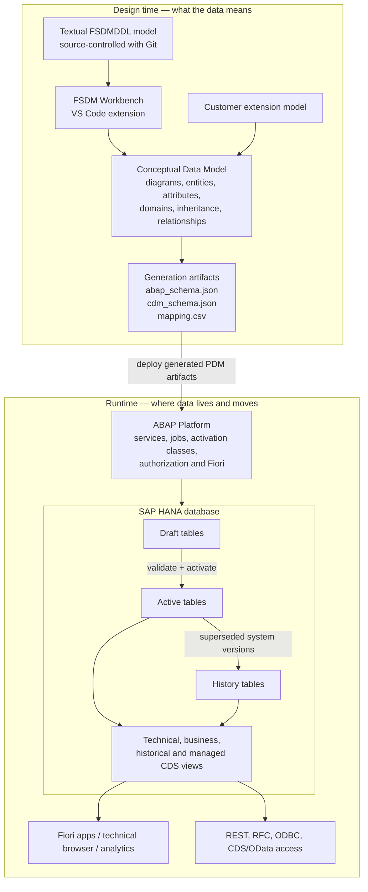
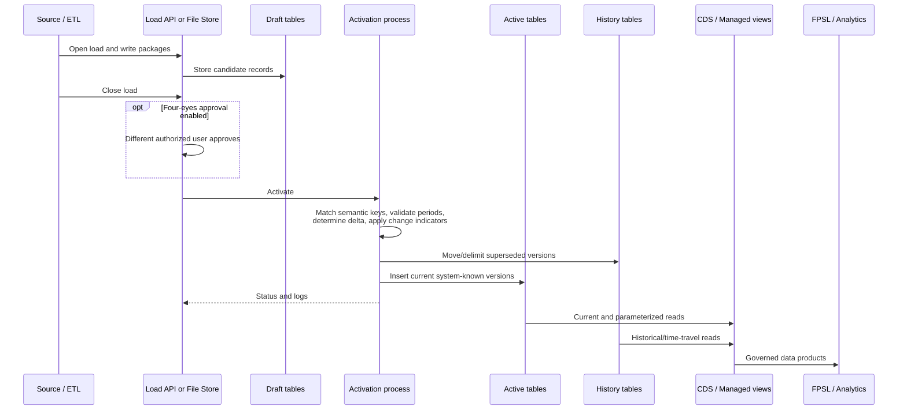
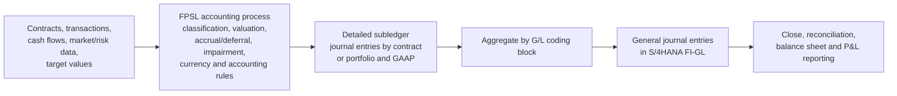
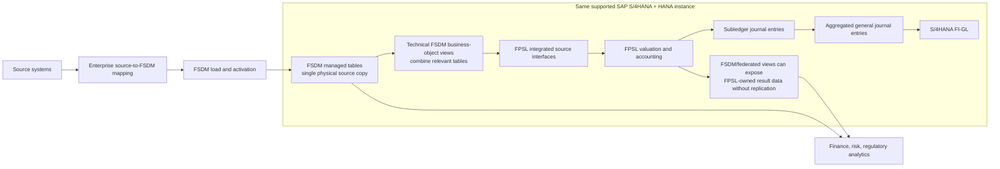
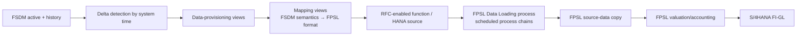
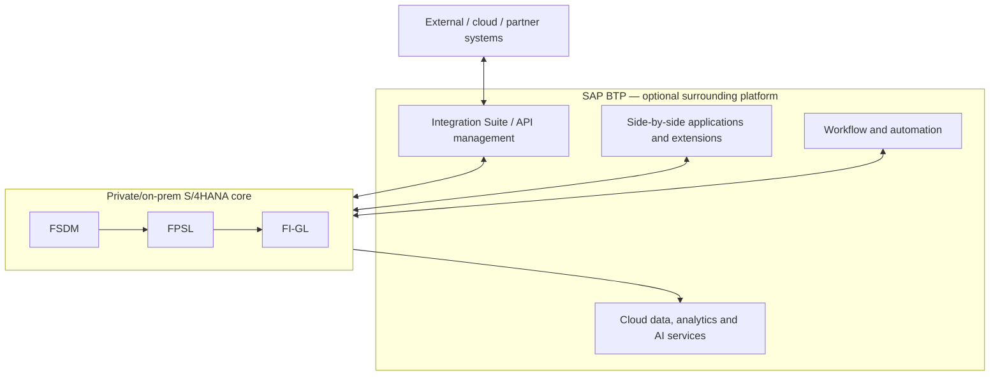

# SAP Fioneer FSDM 2023 — Beginner-to-End-to-End Guide

> **Research baseline:** 25 August 2026  
> **Product line covered:** Fioneer Financial Services Data Management 2023  
> **Current documented feature package at the time of research:** FSDM 2023 1.6.0 (FP06), published 22 May 2026  
> **Primary source:** [FSDM product documentation](https://fsdm.docs.fioneer.com/latest/en/)  
> **Audience:** A reader starting with no SAP, banking-accounting, or temporal-data background

---

## 1. The 30-second answer

Imagine a bank has ten source systems. One calls a home loan `LN`, another calls it `MORTGAGE`, and a third stores only its daily balance. Finance, risk, and regulatory reports will disagree unless somebody standardizes the meaning and history of that data.

**FSDM is that standardized financial-services data foundation.** It receives granular banking data, organizes it in one common business model, keeps the relevant history—including two-dimensional or **bitemporal** history—and exposes consistent data to accounting and analytical consumers.

**FPSL is the specialist accounting engine.** It values financial products, applies accounting rules, creates detailed subledger journal entries, aggregates them, and sends general journal entries to the general ledger.

**SAP S/4HANA is the broader ERP and accounting platform.** FSDM and FPSL are software components/add-ons that run on an ABAP/SAP HANA foundation in the supported architecture; S/4HANA Financial Accounting contains the general ledger that receives summarized accounting entries.

**SAP BTP is a separate cloud technology platform.** It can integrate systems, host extensions and applications, automate processes, provide analytics/data services, and add AI. It can surround and connect the landscape, but it is **not automatically FSDM, FPSL, S/4HANA, or the general ledger**.

The simplest mental model is:

> **Source systems record business → FSDM gives the data one meaning and a trustworthy timeline → FPSL turns it into accounting → S/4HANA General Ledger records the company-level financial impact → analytics and regulatory systems consume governed results.**

---

## 2. Learn these small concepts first

| Term | Very simple meaning | Concrete banking example |
|---|---|---|
| **System of record** | The operational system that originally owns a fact. | A loan-origination system creates home-loan contract `HL-1001`. |
| **Master data** | Relatively stable objects used by transactions. | Customer, contract, security, legal entity, product. |
| **Transaction / flow data** | Something that happened. | A ₹50,000 loan repayment on 15 August. |
| **Result data / key-date value** | A calculated value as of a date. | Loan amortized cost or probability of default on 31 March. |
| **Semantic model** | A common definition of business objects and how they relate. | Every source agrees what “Financial Contract,” “Borrower,” and “Interest” mean. |
| **Harmonization** | Converting differently shaped/source-coded facts into one standard meaning. | `MORTGAGE`, `HL`, and `HOME_LOAN` become one FSDM product/category representation. |
| **Ledger** | The official collection of accounting entries. | Debit Loan Receivable, credit Cash. |
| **Subledger** | A detailed ledger for one domain that feeds the general ledger. | Contract-level loan accounting, later summarized for FI-GL. |
| **General ledger (G/L)** | The enterprise-level accounting book used for balance sheet and profit-and-loss reporting. | All loan receivables for a company code are represented in G/L accounts. |
| **Valuation** | Calculating what an asset/liability is worth under an accounting rule. | Amortized cost of a loan under IFRS 9. |
| **GAAP/accounting principle** | A rulebook for financial reporting. | IFRS and local GAAP may value the same loan differently. |
| **ABAP Platform** | SAP’s application runtime and development platform. | It runs FSDM/FPSL application logic, services, jobs, authorizations, and Fiori apps. |
| **SAP HANA** | SAP’s in-memory relational database. | It stores FSDM managed tables and executes CDS/SQL logic close to the data. |
| **Fiori** | SAP’s web user-experience technology. | An administrator opens the FSDM Loads app in the Fiori Launchpad. |
| **CDS view** | A reusable, semantically described database view defined in ABAP. | A view joins contract, interest, and borrower information for FPSL. |
| **API** | A controlled machine-to-machine interface. | A source integration calls the FSDM Load REST API. |
| **ETL** | Extract, transform, load. | Read loans from a core system, map their fields, and load FSDM. |
| **Bitemporal** | Keeping both “when true in business” and “when the database knew it.” | A rate effective 1 July is entered on 10 July and corrected on 12 July. |

---

## 3. Where every product sits

### 3.1 End-to-end high-level block diagram

```mermaid
flowchart LR
    subgraph SRC[Operational source systems]
        CBS[Core banking<br/>accounts and deposits]
        LMS[Loan system<br/>contracts and cash flows]
        TRD[Trading system<br/>securities and derivatives]
        CRM[CRM / Business partner]
        RSK[Risk and market-data systems]
    end

    INT[Integration / mapping / data-quality layer<br/>ETL, APIs, files; optionally SAP BTP Integration Suite]

    subgraph S4[SAP S/4HANA + SAP HANA / ABAP platform]
        subgraph FSDM[Fioneer FSDM — trusted financial data foundation]
            CDM[Common business meaning<br/>CDM, domains, relationships]
            PDM[Managed physical data<br/>draft, active, history]
            TEMP[Temporal engine<br/>system + business time]
            VIEWS[CDS / managed views / APIs<br/>lineage and data access]
        end

        subgraph FPSL[SAP S/4HANA for FPSL — specialist subledger]
            VAL[Valuation and accounting processes]
            SUBJ[Contract/portfolio-level<br/>subledger journal entries]
            AGG[Aggregation and G/L preparation]
        end

        GL[S/4HANA Financial Accounting<br/>General Ledger]
    end

    subgraph CONS[Consumers]
        SAC[Analytics / SAP Analytics Cloud]
        REG[Regulatory and risk reporting]
        OPS[Reconciliation / audit / operations]
        DW[Enterprise data platform]
    end

    BTP[SAP BTP<br/>integration, extensions, apps,<br/>automation, data/analytics, AI]

    SRC --> INT --> FSDM
    FSDM -->|Harmonized master and flow data| FPSL
    FPSL -->|Aggregated general journal entries| GL
    FSDM --> CONS
    FPSL --> CONS
    GL --> CONS
    BTP -. connects / extends .- INT
    BTP -. APIs, events, apps, analytics .- S4
```

### 3.2 The important boundaries

- **FSDM does not replace a core banking system.** It normally receives operational facts from it.
- **FSDM does not itself perform the full FPSL accounting process.** It can store accounting/risk result data and supply it, but FPSL is the specialist subledger engine.
- **FPSL is not the enterprise general ledger.** It creates detailed subledger entries and transfers aggregated general journal entries to FI-GL or another G/L.
- **S/4HANA is not the same thing as SAP HANA.** S/4HANA is the business application suite; HANA is the database platform underneath.
- **BTP is not required merely to make FSDM “exist.”** It is an optional/adjacent platform for integration, extension, application, automation, data/analytics, and AI scenarios. The documented FSDM–FPSL harmonization scenario instead requires both products on the same supported S/4HANA/HANA instance.

SAP describes FPSL as an S/4HANA add-on built for large volumes and capable of multiple reconciled valuations. It aggregates subledger journal entries into general journal entries for transfer to the G/L ([SAP FPSL overview](https://help.sap.com/docs/SAP_S4HANA_ON-PREMISE/273982318bde4278abeff26a3b020fd9/46b18c91de5c0763e10000000a1553f6.html)). SAP describes BTP as the portfolio covering application development, process automation, integration, data/analytics/planning, and AI ([SAP BTP overview](https://help.sap.com/docs/btp/sap-business-technology-platform/sap-business-technology-platform?locale=en-US)).

---

## 4. What FSDM actually is

Fioneer describes FSDM as a modular data-management solution for banking. Its center is a **unified, standardized, extensible business data model** that gives a holistic view of financial assets and KPIs for finance/accounting, risk, regulatory reporting, and analytics. It supports on-premise and private-cloud deployment on the S/4HANA platform ([FSDM Get Started](https://fsdm.docs.fioneer.com/latest/en/)).

Think of FSDM as four things together:

1. **A banking vocabulary** — standard definitions for partners, contracts, instruments, events, results, and their relationships.
2. **A generated storage design** — HANA-optimized physical managed tables derived from the business model.
3. **A controlled data lifecycle** — draft, validation/activation, active state, history, corrections, permissions, and operational logs.
4. **A serving layer** — CDS/managed views, REST/RFC/ODBC/OData-style access, Fiori browsers, analytics, and integration content such as FPSL adapters.

FSDM is therefore more than a generic database schema, but it is not a magical source-data cleanser. A project must still define source ownership, transformation rules, data-quality controls, code mappings, reconciliation, load orchestration, retention, and operational responsibility.

---

## 5. FSDM internal architecture

### 5.1 Design time versus runtime

The **Conceptual Data Model (CDM)** is business-oriented. The **Physical Data Model (PDM)** is optimized for storage and execution in HANA. There is deliberately not always a one-to-one CDM-to-PDM mapping: conceptual entities may be merged, inherited fields may be flattened, and relationships may become foreign keys. FSDM can generate `abap_schema.json`, `cdm_schema.json`, and `mapping.csv` so that the transformation remains inspectable ([Data Model](https://fsdm.docs.fioneer.com/latest/en/5-DataModel/Readme)).

### 5.2 Core building blocks, in beginner language

| Building block | What it does | Actual conceptual example |
|---|---|---|
| **Diagram** | Groups related model objects visually. | The Bank Account diagram brings together the account, interest, fee, limit, and related partner concepts. |
| **Entity** | Represents an identifiable business thing or concept. | `Financial Contract` represents loan contract `HL-1001`. |
| **Attribute** | Describes one property of an entity. | `FixedRate = 8.25%` on an Interest entity. |
| **Domain** | Reusable datatype plus business meaning/constraints. | Every amount field uses a consistent Amount domain instead of teams choosing incompatible decimals. |
| **Code list/value code** | Allowed standardized values for a domain. | Lifecycle status permits `Active`, `Matured`, and `Cancelled` rather than arbitrary spellings. |
| **Semantic key** | Business identity of a record. | `(OriginatingSourceSystem, FinancialContractID)` identifies the loan even though tables also have technical keys. |
| **Alternative semantic key** | Another approved way to find identity during a load. | A migrated contract can be matched using a legacy contract reference when the new ID is not yet populated. |
| **Relationship** | Connects business objects with cardinality. | One customer can have many loan contracts; each assignment records whether that partner is borrower or guarantor. |
| **Assignment entity** | Represents an indirect many-to-many relationship and can carry facts about the link. | `Business Partner Contract Assignment` links many partners to many contracts and stores each partner’s role. |
| **Inheritance** | A specialized entity receives properties of a broader entity. | `Loan` is a specialized `Financial Contract`; it inherits common contract identity and validity, then adds loan-specific properties. |
| **Persisted/non-persisted entity** | Determines whether a CDM object gets its own physical table. | A conceptual subtype may be flattened into a parent/child PDM table instead of creating another table. |
| **Denormalization** | Stores related conceptual attributes together for efficient physical access. | A 1:1 detail’s fields may be generated into the dominant entity’s PDM table. |
| **Product catalog** | Standard hierarchy/classification of banking products. | A source mortgage maps to a standard catalog item used consistently by the FPSL adapter. |
| **Managed table** | FSDM-managed PDM table with generated lifecycle/view behavior. | The Financial Contract active table contains currently known system versions. |
| **Managed view** | Governed CDS view with metadata, lineage, result-set support, and optional generated UI/write behavior. | A contract view joins contract and interest facts and exposes their lineage. |

FSDM supports 1:1 and 1:n relationships. Instead of direct n:m relationships, FSDM 2023 introduces assignment entities so that properties can later be added to the relationship ([Relationships](https://fsdm.docs.fioneer.com/latest/en/5-DataModel/05_Relationships)). Domains improve governance by making data types and allowed values consistent ([Domains](https://fsdm.docs.fioneer.com/latest/en/5-DataModel/03_Domains)).

### 5.3 Business coverage in the standard model

The documented model includes, among others:

- Business partner and related identification/contact/rating information
- Bank accounts and deposits
- Banking products and product catalog
- Financial contracts, loans, facilities, collateral agreements, and trade finance
- Syndicated lending
- Financial instruments and securities trading
- Derivatives and commodities
- Market data and organizational/legal-entity concepts
- Business events, settlements, and cash flows
- Credit-risk facts and calculated results
- Accounting and subledger result data
- Sustainable finance: SDGs, sustainability frameworks, carbon accounting, ESG ratings and risks, environmental instruments, sustainability bonds, and sustainability loans

This is a **semantic coverage list**, not a promise that every source-system field maps automatically. A bank normally extends the model and its integration content where its products or regulations require it.

### 5.4 Extensibility and model lifecycle

FSDM’s model is stored in a textual domain-specific language, so teams can use source control and collaboration practices. In the Workbench, a modeler can add diagrams, entities, attributes, domains, relationships, value codes/code lists, and alternative semantic keys; generate the schemas; import them into the ABAP environment; and deploy the extension ([FSDM overview](https://fsdm.docs.fioneer.com/latest/en/1-G2K/G2K_FSDM), [extension workflow](https://fsdm.docs.fioneer.com/latest/en/3-Workbench/70-ExtendingTheDataModel/01_CreatingCDMExtensionFile)).

**Example:** A bank finances rooftop-solar installations and must store `GreenTaxonomyEligibility`. A modeler adds an extensible Boolean/code domain and attribute to the appropriate sustainable-loan concept, reviews the generated CDM-to-PDM mapping, deploys the customer namespace artifacts, and then extends ingestion and reporting views.

---

## 6. The complete data lifecycle inside FSDM

### 6.1 Load-to-consumption flow

### 6.2 Draft, active, and history

| Status | Meaning | Example |
|---|---|---|
| **Draft** | Data has arrived but is not yet activated for normal business use. | A package with 100,000 loans is staged while validation runs. |
| **Active** | Versions currently known by the system are available to standard business views. | The currently known interest-rate periods for `HL-1001`. |
| **History** | Superseded system versions retained for traceability/time travel. | The version showing the mistaken 8.5% rate that the bank knew from 10–12 July. |

Draft records include load/package/record identifiers. Active and history storage use generated technical keys such as record number and partition key. After successful activation, draft data is cleaned up. Technical CDS views expose table-level details; business views hide some technical mechanics ([Data tables and views](https://fsdm.docs.fioneer.com/latest/en/4-ABAPCloud/G2K_ABAP)).

### 6.3 Write options

| Interface/mechanism | Best fit | Example |
|---|---|---|
| **FSDM Files app / File Store** | Manual implementation/testing and controlled file staging. Supports CSV, XLSX, JSON, and ZIP conventions. | An analyst uploads a small product-catalog CSV during setup. |
| **WebDAV** | File-store access from a desktop/tool during implementation or special file workflows. | A test team copies scenario files into its folder. |
| **Load REST API (OpenAPI)** | Recommended high-volume external loading path. | An enterprise ETL posts loan packages and then closes/activates the load. |
| **RFC API** | SAP-to-SAP communication. | An ABAP source calls the load functions through an RFC destination. |
| **AMDP `WRITE_DRAFT`** | Data already in HANA or reachable by HANA remote sources, avoiding movement through the ABAP app server. | A HANA-resident staging table writes directly into generated draft structures. |
| **Write-enabled managed view** | FP06 governed outbound/write-through scenario to FPSL or another S/4HANA table through annotated managed views. | An activated result view supplies target records to an FPSL-owned table. |
| **Post-Activation Procedure (PAP)** | Near-real-time follow-on procedure after activation. | Once a settlement load activates, an AMDP triggers the configured downstream preparation logic. |

FSDM recommends REST for mass upload; manual file/ABAP techniques are more suitable for implementation and testing ([Write Interfaces](https://fsdm.docs.fioneer.com/latest/en/5-Integration/10-Integrate_Data/Write_Interfaces)). The File Store is staging, not a replacement for a production-grade ingestion/ETL design ([FSDM Files](https://fsdm.docs.fioneer.com/latest/en/4-ABAPCloud/30-FioriApps/Admin/App_File_Manager)).

### 6.4 Activation capabilities

| Capability | Meaning | Example |
|---|---|---|
| **Transactional load** | Related changes are controlled as a load rather than appearing halfway through ingestion. | Contract and interest records are staged before activation. |
| **Semantic-key matching** | Activation matches the business object, not merely a generated row ID. | Incoming `CORE01 + HL-1001` finds the existing loan. |
| **Delta determination** | Unchanged data can avoid creating another system version. | A nightly identical loan snapshot creates no new version. |
| **No-delta option** | Force a new version even when content appears unchanged. | A regulated snapshot must record that a certified load occurred. |
| **Upsert** | Insert if absent, update/version if present. | A new loan is inserted; an existing loan’s future rate period is revised. |
| **Change-indicator delete** | Delete/delimit the requested validity interval according to the entity’s versioning. | Remove a fee only for 1–30 September without erasing other valid periods. |
| **Anonymization on load** | Replace sensitive fields with substitutes, subject to authorization. | Production customer names become synthetic names in a test system. |
| **NULL handling** | Distinguish an unknown/missing value from a literal blank or zero. | `CollateralValue = NULL` means not known; `0` means known to have no value. |
| **Packages and split/subloads** | Divide a large load for processing/diagnosis. | Split 20 million contracts into independently processed packages. |
| **Parallel/data-set locking** | Fine-grained locks allow independent data sets to activate concurrently. | Legal-entity A and B data sets load in parallel without changing the same partition. |
| **Partial activation (FP06)** | Activate eligible parts of a load to improve scalability/operations. | Valid contract packages activate while a separately handled package is investigated, according to configured semantics. |
| **Logs and status monitoring** | Follow open, closed, activating, active, or error states and inspect messages. | An overlap error links an operator to the problematic draft data. |

Deletion is temporal for versioned data: it delimits/moves the affected period into history. Only a non-versioned record is physically removed from active storage by that operation ([Loading and Activating Data](https://fsdm.docs.fioneer.com/latest/en/1-G2K/20-Versioning/LoadingAndActivatingData)).

---

## 7. Versioning, history, and bitemporality — carefully explained

### 7.1 There are two different clocks

1. **Business time:** When was the fact true in the real business world?
2. **System time:** During what period did FSDM believe/store that version?

These answer different audit questions:

- “What rate legally applied on 5 July?” → business time.
- “What did our system say on 11 July about the rate on 5 July?” → system time plus business time.

### 7.2 Versioning schemes

| Scheme | Fields | What it answers | Concrete example |
|---|---|---|---|
| **Not versioned** | No temporal validity pair | Only the current stored state matters. | A technical privacy-detail record is physically removed when deleted. |
| **System-time versioned** | `SystemValidFrom`, `SystemValidTo` | When did FSDM know each version? | A settlement is stored at 10:00; a later system version would normally preserve the previous record, subject to FPSL restrictions. |
| **Business-time versioned** | `BusinessValidFrom`, `BusinessValidTo` | When is it true in business? | A custom extension stores a planned branch classification effective next month. FSDM 2023 ships no standard entity using business-only versioning, but extensions may use it. |
| **Bitemporal** | Both validity pairs | What was true, and what did the system know at any earlier system time? | A loan rate effective 1 July is entered late on 10 July, then corrected on 12 July. |

The versioning scheme is configured per entity in the CDM and carried to the PDM. A Financial Contract can be bitemporal while event-like Settlement data uses only system time ([Versioning](https://fsdm.docs.fioneer.com/latest/en/1-G2K/20-Versioning/Versioning)).

### 7.3 Open-closed validity intervals

FSDM uses **start inclusive, end exclusive** intervals: `[ValidFrom, ValidTo)`.

If version A is valid `[2026-01-01, 2026-07-01)` and version B is valid `[2026-07-01, 9999-12-31)`, then:

- At 30 June, A applies.
- At exactly 1 July, B applies.
- There is no double-counting at the boundary.

**Conceptual example:** A fixed interest rate of 8% ends when 1 July begins; 8.5% begins at that exact boundary.

### 7.4 Full bitemporal example

Suppose home-loan `HL-1001` legally moved from 8.00% to 8.50% on **1 July**. The update reached FSDM only on **10 July**. On **12 July**, operations discovered that the signed rate was really **8.25%**, not 8.50%.

| Rate | Business valid period | System valid period | Interpretation |
|---:|---|---|---|
| 8.00% | `[1 Jan, 1 Jul)` | `[1 Jan system load, ∞)` | The old rate remains true before July. |
| 8.50% | `[1 Jul, ∞)` | `[10 Jul, 12 Jul)` | This is what FSDM believed for two days. |
| 8.25% | `[1 Jul, ∞)` | `[12 Jul, ∞)` | Corrected knowledge, still effective from 1 July. |

Now four questions become possible:

| Question | Answer |
|---|---|
| What rate applies to business date 5 July, using today’s knowledge? | 8.25% |
| What did the system say on 11 July for business date 5 July? | 8.50% |
| What applies to business date 20 June, using today’s knowledge? | 8.00% |
| When did the bank’s stored knowledge change from the wrong to correct value? | 12 July |

This is more powerful than a simple `last_updated_at`. A single timestamp cannot reconstruct both the real-world effective date and the knowledge/correction timeline.

### 7.5 “History” versus “versioning”

- **History table** is a physical/runtime storage concept for superseded system versions.
- **System versioning** is the rule that says when knowledge versions are valid.
- **Business versioning** divides the object into business-effective intervals.
- **Bitemporal versioning** combines both.
- **Audit logging** records actions/events; it is useful but is not the same as queryable bitemporal state.
- **Git versioning of the model** tracks changes to the model definition; it is completely different from versioning business records.

### 7.6 Time-travel data access

For a system-versioned table, FSDM provides active/history technical views and parameterized business access. For a bitemporal entity, a generated `/FSDM/UV_...` business view accepts:

- `I_BUSINESS_DATE`
- `I_SYSTEM_TIME`

For a system-only entity, only `I_SYSTEM_TIME` is needed. This view reads active plus history and returns the correct version for the requested time ([Data Access](https://fsdm.docs.fioneer.com/latest/en/1-G2K/20-Versioning/DataAccess)).

**Example:** An auditor runs the historical view with business date `2026-07-05` and system time `2026-07-11T18:00:00Z`; FSDM returns 8.50%, even though today’s corrected rate is 8.25%.

### 7.7 Delete, corrections, and future changes

- **Backdated change:** Entered today but effective in the past. Example: borrower classification effective 1 April arrives on 20 April.
- **Future-dated change:** Known today but effective later. Example: loan rate will become 8.75% on 1 October.
- **Correction:** Replaces what the system previously believed while preserving that former belief in system history. Example: customer name typo corrected today, business validity unchanged.
- **Temporal deletion:** Removes only an effective interval. Example: a fee was not applicable during September, so that period is carved out and surrounding periods remain.

Overlapping business periods for the same semantic key are rejected where they would make the version ambiguous. FSDM’s activation logic may split surrounding valid periods when an inserted/deleted interval lies inside them.

### 7.8 UTC behavior

Timestamp fields are stored in UTC. Fiori can display the user’s local time zone, while database/technical tools may show UTC. This prevents global loads from silently interpreting local timestamps differently ([System Logic for Time Zones](https://fsdm.docs.fioneer.com/latest/en/4-ABAPCloud/TimeZone)).

**Example:** `08:00 UTC` is shown as `13:30` to an India user (UTC+05:30), but the stored fact remains `08:00 UTC`.

---

## 8. Read, reporting, transparency, and governance features

### 8.1 Read interfaces and views

| Feature | Purpose | Example |
|---|---|---|
| **Model REST API** | Query model metadata and support extensions. | A tool retrieves the entity definition for Financial Contract. |
| **REST read/extraction** | Controlled HTTP extraction of data/view results. | A downstream reporting service reads a governed contract view. |
| **ODBC for ABAP/CDS** | SQL-style read access without direct unmanaged HANA table access. | Excel/BI connects through the SAP ABAP ODBC driver to an exposed CDS service. |
| **ABAP CDS views** | Reusable semantic/analytical views close to HANA. | A view calculates active contracts by product hierarchy. |
| **Technical views** | Show draft/active/history plus technical load and storage fields. | Operations traces load 7944, package 3, record 27. |
| **Business views** | Hide unnecessary storage mechanics and expose semantic keys/validity. | An application reads the currently known loan view. |
| **Historical parameterized views** | “Time travel” over system and business dates. | An auditor reconstructs month-end using what was known at close time. |
| **Managed views** | Catalog, document, generate UI for, trace lineage of, and expose CDS views. | A modeler sees that `FPSL Contract Rate` derives from FSDM Interest. |
| **Result sets** | Temporary, consistent materialization of a parameterized view at a timestamp. | FPSL extraction holds a stable result while source data continues changing. |

FSDM discourages direct SQL access to unmanaged underlying ABAP/HANA tables. CDS-based access preserves semantics and authorization behavior ([ODBC API](https://fsdm.docs.fioneer.com/latest/en/5-Integration/10-Integrate_Data/20-ODBC), [ABAP CDS Views](https://fsdm.docs.fioneer.com/latest/en/5-Integration/10-Integrate_Data/CDS_Views)).

### 8.2 Data lineage

Managed views can persist, display, and download field-level lineage. “Fine” lineage connects a target field to the source field from which it is derived.

**Example:** A finance analyst clicks the lineage for FPSL’s interest-rate field and traces it through an FSDM mapping view to the `FixedRate` attribute in the Interest managed table. This explains *where a number came from*, not merely what the number is.

### 8.3 Fiori administration and modeling apps

Major documented app groups include:

- **Administration:** Loads, Files, Logs, Data Corrections, Technical Data Browser, Custom Business Configurations, and Application Jobs.
- **Modeling/governance:** Entities (CDM), Managed Tables (PDM), Domains, Value Codes, Managed Views, Tags, Extensions, and diagram browsing.
- **Business Data Browser:** prepared views for business partner, financial contract, and financial instrument base/key-figure/accounting examples.
- **Multidimensional reporting:** Ad Hoc Analysis plus sample Active Contracts, Contract Book Value, Instrument Book Value, and Instrument Balance apps.

The embedded reporting examples use analytical CDS/InA and pivot-style controls. Fioneer explicitly says production performance must be tested for the bank’s data volume and query complexity ([Multidimensional Reporting Apps](https://fsdm.docs.fioneer.com/latest/en/4-ABAPCloud/30-FioriApps/Multi_Rep/Multi_Rep)).

### 8.4 Tags and metadata search

Tags add flexible metadata to model/runtime objects for ownership, boundaries, regulation, or topic searches.

**Example:** Tag every entity/view contributing to regulatory capital reporting with `CRRIII`, assign owners, and filter the model to find the entire scope. Tags improve discovery; they do not replace formal data definitions or authorization.

### 8.5 Manual corrections and correction monitoring

Authorized users can correct data through supported Fiori flows; the Data Corrections app lets administrators monitor and review these manual interventions.

**Example:** Operations fixes the wrong maturity date for one loan after evidence is approved. The correction is visible for operational review, and temporal history preserves earlier system knowledge where applicable. The strategic fix must still be made upstream, otherwise the source may overwrite the correction in the next load.

### 8.6 Approval / four-eyes principle

An environment can require a different authorized user to approve a file/load before activation. Approval can be time-limited and revoked before activation.

**Example:** A data loader uploads a quarter-end rating file; a finance-control approver reviews and approves it before it becomes active. This reduces one-person production changes.

### 8.7 Security and client isolation

FSDM inherits SAP authentication, role, encryption, and platform security mechanisms, and adds its own authorization objects/roles. Important layers are:

- SAP client separation: a logged-in user/interface sees only its client.
- ABAP roles and authorization objects for administrator, modeler, analyst, and loader tasks.
- CDS Data Control Language (DCL) for row-level access.
- `AUTH_OWNER` on draft, active, and history tables/views for organization-specific ownership restrictions.
- Secure transport such as SSL and SNC; HANA security for storage.
- File-level and load-level authorizations.
- Data privacy operations including anonymization; retention/blocking/deletion still require a complete legal and ILM design.

**Example:** An analyst authorized for owner `IN_BANK` can read only that owner’s contracts through a CDS view, while another client’s records are technically separated ([Client and Authorization Concept](https://fsdm.docs.fioneer.com/latest/en/2-Admin/25-Authorization/Authorization)).

### 8.8 Operations and housekeeping

Application-job templates cover load-and-activate, activation, model cleanup, extension deployment/removal, bulk tagging, mapping-content upload, and housekeeping for large/old files, unactivated loads, and temporary result tables.

**Example:** A nightly housekeeping job detects result sets left open by failed tests and removes them after the bank’s retention/operational policy permits it.

---

## 9. What FPSL is, from zero

### 9.1 Why a bank needs a specialist subledger

A normal ERP general ledger cannot efficiently keep every cash flow, valuation step, accounting rule, and journal detail for millions of financial contracts. A specialist subledger handles that detail, reconciles multiple accounting views, then sends summarized entries to the G/L.

**FPSL** means **Financial Products Subledger**. The product name is **SAP S/4HANA for financial products subledger**. It supports banks, insurers/reinsurers, fintechs, and other companies with financial products. It is deployed as an add-on to S/4HANA and uses HANA for large-volume processing ([SAP FPSL overview](https://help.sap.com/docs/SAP_S4HANA_ON-PREMISE/273982318bde4278abeff26a3b020fd9/46b18c91de5c0763e10000000a1553f6.html)).

### 9.2 FPSL’s job

FPSL can:

- Receive source transactions and create subledger entries at contract or portfolio level.
- Receive preliminary subledger journal entries and complete them.
- Receive target values and derive journal entries.
- Value financial instruments using methods such as amortized cost or fair value.
- Support multiple accounting principles/currencies and reconciled valuations.
- Use central-GAAP plus delta-GAAP postings so common postings are stored once and principle-specific differences separately.
- Produce forecasts, plans, simulations, and provisional/trial results.
- Aggregate detailed subledger entries and transfer general journal entries to FI-GL or another connected G/L.

**Concrete example:** For `HL-1001`, FPSL consumes contract terms, scheduled/actual cash flows, market data, and impairment inputs. It calculates interest accrual and amortized cost, creates IFRS and local-GAAP subledger postings, aggregates them with other loans, and sends G/L postings such as Loan Receivable and Interest Income.

### 9.3 What comes from where in the harmonized landscape

According to SAP’s integrated-source description:

- **FSDM supplies operative facts:** financial contracts, instruments/securities, trades, business partners, and business transactions/settlements.
- **FPSL owns accounting objects/results:** portfolios and assignments, expected cash flows in the documented split, target values, analytical statuses, and subledger journal entries.
- **S/4HANA supplies shared ERP/finance data:** market data in the documented architecture and general journal entries/G/L; business partner can come from FSDM or S/4HANA depending on design.

The precise object ownership must be fixed in a project architecture; “both systems can represent it” is not a valid ownership rule.

---

## 10. FSDM ↔ FPSL integration

### 10.1 The two scenarios

| Topic | **Harmonization scenario (recommended for new customers)** | **Replication scenario (older/existing option)** |
|---|---|---|
| Basic idea | FPSL directly reads/uses FSDM-governed source data; no second physical copy of those source objects in FPSL. | FPSL pulls mapped data and stores a separate copy in its source-data structures. |
| Deployment | FSDM and FPSL must be separate products installed on the **same supported S/4HANA/HANA instance** for the documented scenario. | They may be in one or two HANA instances; RFC/WebSocket RFC or local calls and DL process chains transfer data. |
| Source of truth | FSDM is the single source for integrated master/flow objects. | FSDM is source, but FPSL contains a replicated operational copy. |
| Access mechanism | FPSL-defined interfaces and FSDM business-object CDS views combine all relevant FSDM tables. | Provisioning/extraction views → mapping views → RFC-enabled functions/DL process → FPSL storage. |
| Latency | Direct shared access; avoids scheduled-copy latency for governed objects. | Batch/delta cadence depends on process chains and load completion. |
| Reconciliation | Less duplication; shared semantics improve consistency. | Must reconcile FSDM source versions with FPSL replicated copies and failed/restarted deltas. |
| Migration/fit | Target architecture for new implementations. | Supported for existing implementations; switching requires project design and testing. |

Fioneer explicitly recommends harmonization for new customers and says FPSL requires separate licensing ([FSDM–FPSL integration](https://fsdm.docs.fioneer.com/latest/en/5-Integration/20-Integrate-Product/FPSL)). SAP’s prerequisites for direct FSDM sourcing include compatible feature packages and co-installation on the same S/4HANA instance ([SAP integrated FSDM source](https://help.sap.com/docs/SAP_S4HANA_ON-PREMISE/273982318bde4278abeff26a3b020fd9/5812469f074143c292c683c170091055.html)).

### 10.2 Harmonization scenario flow

FSDM technical business-object views combine data across all relevant tables:

- Business Partner: `/FSDL/BO_BUSINESS_PARTNER`
- Financial Contract: `/FSDL/BO_FINANCIAL_CONTRACT`
- Financial Instrument: `/FSDL/BO_FINANCIAL_INSTRUMENT`
- Settlement: `/FSDL/BO_SETTLEMENT`

For instance, a complete contract object may combine Financial Contract, Interest, Business Partner Contract Assignment, and other managed tables; trades are treated as contracts for the FPSL interface ([Technical Business Object Views](https://fsdm.docs.fioneer.com/latest/en/5-Integration/20-Integrate-Product/Harmony/BOViews_Tech)).

**Actual conceptual example:** FPSL requests contract `HL-1001`. The contract BO view assembles its identity, product assignment, borrower relationship, interest conditions, and relevant temporal version directly from FSDM. FPSL does not first copy these into a second embedded source-data table. It then performs accounting using that coherent object.

### 10.3 Replication scenario flow

Replication details:

1. A process chain finds records created or changed since the previous run using FSDM **system time**.
2. For multi-table objects, it finds each changed business date and reconstructs a complete object version by selecting/joining all table versions valid on that date.
3. Mapping views translate fields and code values into FPSL’s format and apply configured filters.
4. FPSL’s Data Loading (DL) process pulls the data through configured sources/RFC functions.
5. FPSL stores/processes the replicated data and reports success/error through process-chain operations.

**Multi-table example:** Only the `NotionalSchedule` of a cross-currency swap changes, effective 1 December. Delta logic detects that change, chooses 1 December as the business date, joins the other unchanged contract tables as valid on that date, builds a complete FPSL contract representation, and transfers it ([Set Up Process Chains](https://fsdm.docs.fioneer.com/latest/en/5-Integration/20-Integrate-Product/Process_Chain)).

### 10.4 Objects sent to FPSL

The integration content covers categories such as:

- **Master data:** financial contracts, business-partner assignments, limits, contract relations/master contracts, financial instruments/securities, securities accounts.
- **Flow data:** settlements/business transactions, trades, contractual cash flows, and expected cash-flow scenarios where supported.
- **Key-date/result data:** accruals/accrued interest, amortized cost, fair value, impairment/write-down/classification statuses, credit-risk adjustments, PD, LGD, days past due, ratings, collateral fair value, deferrals, currency/interest-risk adjustments, and preliminary subledger documents.
- **Market data:** exchange rates and security prices in replication content.
- **Accounting-related structures:** product mapping, legal entity, portfolio/hedge-related result structures, and relevant status/result views.

Not every FSDM record is sent. Integration views, fixed filters, configurable collection filters, role/status/transaction-type mappings, product-catalog mappings, and result-granularity settings define the FPSL scope ([Filter and Configuration Options](https://fsdm.docs.fioneer.com/latest/en/5-Integration/20-Integrate-Product/Filter)).

### 10.5 Value mapping

FSDM and FPSL may use different codes for the same meaning. Mapping tables translate them; views read these tables during integration.

**Example:** FSDM product item `HOME_LOAN_FIXED` maps to the FPSL product/accounting classification required by its valuation process. A transaction type, business-partner role, lifecycle status, or accrual category can likewise be mapped. Some target values depend on multiple inputs, such as accrual type, interest type/subtype, and amount sign ([Value Mapping](https://fsdm.docs.fioneer.com/latest/en/5-Integration/20-Integrate-Product/ValueMapping)).

### 10.6 Version mapping and restrictions

FPSL and FSDM do not use identical versioning for every object. The adapter includes initialization and version-mapping logic for master data, key-date results, and flows.

Important restriction: FPSL business transactions and posting documents are not technically/business versioned like general FSDM bitemporal master data. For consistency, the corresponding FSDM Settlement and FS Subledger Document records cannot be updated or deleted in the integration scenario; erroneous attempts fail. Initial-load settings decide whether to transfer all versions, the version valid on an initialization date, or versions valid after it ([Map Versions](https://fsdm.docs.fioneer.com/latest/en/5-Integration/20-Integrate-Product/Versioning)).

**Example:** A posted repayment is an immutable event; correction is normally represented by a new reversing/correcting transaction, not silently rewriting the old settlement.

### 10.7 IDs and field restrictions matter

- Use consistent, preferably uppercase identifiers across FSDM/FPSL where FPSL fields are case-insensitive/uppercased.
- Keep IDs unique across source systems or include the originating-system component.
- Respect target field lengths and datatypes.
- Model payer/header/leg roles consistently.
- Derive legal entity/company code according to the integration rules.

**Example:** `hl-1001` in one source and `HL-1001` in FPSL can create reconciliation trouble; normalize it before FSDM ingestion and preserve source identity explicitly ([Good to Know about Mapping Data](https://fsdm.docs.fioneer.com/latest/en/5-Integration/20-Integrate-Product/Good2Know)).

---

## 11. What SAP S/4HANA contributes

SAP S/4HANA is the ERP suite running on SAP HANA. In this landscape it provides:

- The ABAP/HANA application foundation on which compatible FSDM and FPSL components run.
- SAP Fiori Launchpad and shared administration/security technology.
- Financial Accounting and the enterprise General Ledger (FI-GL).
- Shared organizational concepts such as company code/legal entity mappings.
- Other ERP processes and master/market data depending on architecture.

FPSL aggregates detailed subledger journal entries by the G/L coding block and prepares/sends general journal entries to FI-GL. The G/L retains enterprise accounting totals and reporting dimensions; FPSL keeps the contract/portfolio accounting detail ([General Ledger Connection](https://help.sap.com/docs/S4HANA_FIN_PROD_SUBLEDGER/1eb342bb498c49b489998bb873d469cf/b007de55a5fea544e10000000a44147b.html)).

**Example:** FPSL may produce 500,000 loan-level subledger lines for a day, then aggregate compatible lines into far fewer G/L entries by company code, ledger, account, currency, profit center, and other coding-block fields.

---

## 12. What SAP BTP is—and is not

SAP Business Technology Platform is SAP’s cloud platform for:

- **Integration:** connect SAP/non-SAP applications, APIs, files, events, and partners.
- **Application development and extension:** build side-by-side apps without modifying the S/4 core.
- **Process automation:** workflows, approvals, and task automation.
- **Data and analytics:** cloud data products, planning, analytics, and related services.
- **AI:** consume/build governed AI-enabled processes.
- **Identity, security, and operations services** appropriate to the chosen BTP architecture.

### Where BTP could fit

**Concrete examples:**

- Integration Suite receives a cloud loan-platform event, validates/routes it to the bank’s ETL/FSDM Load API, and monitors the interface.
- A BTP app displays an exception workflow combining FSDM load errors and business approval tasks.
- SAP Analytics Cloud consumes governed analytical views/results.

**Do not infer:** “FSDM runs on BTP” merely because BTP appears in the enterprise diagram. FSDM’s documented deployment is an ABAP add-on on supported S/4HANA on-premise/private cloud. BTP is a possible integration/extension plane around it.

---

## 13. One complete real-world conceptual example: a home loan

This example connects nearly every concept.

### Step 1 — Origination

Customer Asha signs home loan `HL-1001` for ₹5,000,000 at 8.00%. The Loan Management System is the system of record.

- Master data: Asha, loan contract, product, legal entity.
- Flow data: disbursement.
- Terms: interest schedule, maturity, installments.

### Step 2 — Source-to-FSDM harmonization

The source calls the product `MORT-FIX`; the bank maps it to a standard FSDM product-catalog item. Source customer ID and contract ID are combined with `OriginatingSourceSystem` to prevent collision with other systems.

### Step 3 — Load and activation

ETL opens a load, writes Business Partner, Financial Contract, Partner Contract Assignment, Interest, and Payment Schedule packages to draft, closes the load, and triggers activation. FSDM validates semantic keys, relationships, and business periods; accepted data moves to active.

### Step 4 — Temporal change

The rate changes effective 1 July. It arrives on 10 July as 8.50%, then is corrected on 12 July to 8.25%.

- Business time explains that the new rate applies from 1 July.
- System time explains that the bank stored 8.50% from 10–12 July.
- History retains the superseded knowledge.
- A time-travel query can reproduce the 11 July report exactly.

### Step 5 — FPSL input

In harmonization, FPSL reads the complete contract through FSDM business-object views on the same instance. In replication, a system-time delta process reconstructs the complete 1 July version, maps its codes, and copies it into FPSL.

### Step 6 — Accounting

FPSL receives the loan, actual/expected cash flows, market/risk data, and accounting settings. It calculates accrual/amortized cost and impairment-related values as applicable, producing subledger journal entries for each accounting principle.

### Step 7 — General Ledger

FPSL aggregates compatible loan-level entries and sends general journal entries to S/4HANA FI-GL. The G/L is used for official company-level balance sheet/P&L reporting; drill-down/reconciliation uses FPSL detail.

### Step 8 — Analytics and regulation

Risk reporting reads contract and result data using governed views. A lineage graph shows the report’s rate field came from FSDM Interest and the accounting carrying amount came from FPSL. BTP/SAC can provide cloud integration or analytics, but they do not change source ownership.

### Step 9 — Audit question

An auditor asks: “Why did the 11 July accrual use 8.50% although the signed rate was 8.25%?”

FSDM reconstructs what the system knew on 11 July; load logs identify the inbound load; history shows correction on 12 July; lineage shows the FPSL input mapping; FPSL explains the accounting calculation and journal; FI-GL shows the aggregated posting. This is the end-to-end audit chain.

---

## 14. Feature-to-example checklist

This table is a compact “did we cover it?” reference.

| FSDM capability | Practical value | One example |
|---|---|---|
| Unified banking model | One meaning across sources | Three mortgage codes become one product concept. |
| Single source of truth | Reduces duplicate/conflicting facts | Finance and risk read the same contract version. |
| Granular data | Supports drill-down | Trace a G/L total back toward contract `HL-1001`. |
| Result reuse | Avoid recalculating everywhere | Reuse approved PD/LGD results for reporting/accounting input. |
| CDM | Business-readable design | Model Customer–Loan–Collateral relationships. |
| PDM | HANA-optimized runtime | Generated managed tables store those objects efficiently. |
| CDM-to-PDM mapping | Explain model transformation | Trace conceptual Fixed Rate to its physical column. |
| Workbench | Browse/model/generate | Add green-taxonomy eligibility in VS Code. |
| Textual model + Git | Govern model changes | Review a new attribute in a pull request. |
| Extension model | Add bank-specific scope | Add local regulatory classification. |
| Domains/code lists | Consistent quality | Only approved lifecycle-status codes are accepted. |
| Relationships/cardinality | Correct object connections | One loan has many scheduled payments. |
| Assignment entity | Rich many-to-many link | Store borrower/guarantor role on partner–contract link. |
| Inheritance | Reuse broad definitions | Loan inherits Financial Contract properties. |
| Denormalization/PDM optimization | Efficient access | 1:1 detail fields share a physical table. |
| Product catalog | Product harmonization/FPSL mapping | Map `MORT-FIX` to standard home-loan product. |
| System versioning | Knowledge-time audit | Show when a rating correction was stored. |
| Business versioning | Effective dating | Rate starts next quarter. |
| Bitemporal versioning | Full “effective vs known” reconstruction | Late, then corrected July rate. |
| Open-closed periods | Unambiguous boundaries | Old rate ends exactly when new rate starts. |
| Draft/active/history | Safe lifecycle and traceability | Stage, activate, retain replaced version. |
| Delta determination | Avoid redundant versions/work | Identical nightly snapshot creates no new version. |
| Upsert | Simple insert/update behavior | New loan inserts; existing loan versions. |
| Temporal delete | Remove only an applicable interval | Remove September fee, preserve other months. |
| Anonymization | Safer non-production data | Replace Asha’s name with a synthetic value. |
| NULL support | Preserve unknown vs zero | Unknown collateral value is not ₹0. |
| Loads/packages/subloads | Scale and diagnose | Split 20 million contracts by package. |
| Data-set locking/parallelism | Concurrent independent activation | Two legal entities load in parallel. |
| Partial activation | Better large-load operations | Process valid packages without redoing all work. |
| Approval process | Four-eyes control | Loader and approver are different people. |
| Manual correction monitoring | Controlled exception handling | Review maturity-date correction. |
| UTC time logic | Global consistency | India UI converts stored UTC timestamp. |
| File Store/WebDAV | Controlled implementation staging | Upload sample product catalog. |
| REST/OpenAPI | Standard mass integration | ETL posts loan packages. |
| RFC | SAP-to-SAP integration | FPSL calls FSDM extraction function. |
| AMDP | In-database processing | HANA staging writes to draft without app-server round trip. |
| Technical/business/historical CDS | Right view for each audience | Operator sees package ID; analyst sees semantic contract. |
| ODBC | Governed SQL-style access | BI tool queries published CDS. |
| Managed views | View catalog/governance | Publish a documented custom accounting view. |
| Write-enabled managed views | Governed outbound write | Activated view writes target data to an FPSL table. |
| PAP | Post-activation integration | Trigger prepared downstream action after activation. |
| Result sets | Stable temporary extraction | FPSL processes a snapshot while loads continue. |
| Lineage | Explain field origin | Report rate traces to Interest.FixedRate. |
| Tags | Search/ownership/regulation metadata | Filter all `IFRS9` or `CRRIII` objects. |
| Fiori browsers | Human exploration | Credit analyst views loan, partner, and limits. |
| Embedded ad hoc analytics | Fast exploration | Pivot active contracts by product and legal entity. |
| Logs/application jobs/housekeeping | Operability | Diagnose overlap; clean abandoned temporary tables. |
| Client segregation | Tenant/legal separation | Client A cannot see client B’s data. |
| `AUTH_OWNER` + DCL | Row-level ownership access | Analyst sees only `IN_BANK` contracts. |
| Harmonized FPSL integration | No duplicated source copy | FPSL directly reads FSDM contract BO view. |
| Replicated FPSL integration | Supports existing separated landscapes | Process chain pulls system-time deltas. |
| Value mapping/filtering | Correct target codes/scope | Send only approved product/status categories. |
| Sustainable-finance model | ESG/regulatory readiness | Store loan taxonomy and emissions facts. |
| Extensible system documentation | Context-sensitive project knowledge | Custom view links to bank-authored definition. |

---

## 15. What FSDM does not give you automatically

1. **It does not automatically discover correct source meaning.** Your project must map and reconcile it.
2. **It does not guarantee data quality just because a standard model exists.** You must define validation, ownership, and exception workflows.
3. **It is not an accounting-rule engine equivalent to FPSL.** Storing accounting results is different from calculating/posting them.
4. **It is not the general ledger.** FI-GL or another G/L remains the official enterprise ledger.
5. **It is not a generic lakehouse replacement.** It is an ABAP/HANA financial-services data foundation with a governed domain model; an enterprise lake/lakehouse may still coexist.
6. **Bitemporal history is not free operationally.** It increases storage, query, load, and reconciliation complexity; it should be applied per entity based on business/audit need.
7. **The sample reporting apps are not automatically production-scale reports.** Performance testing and consumer-specific view design are required.
8. **“Direct” harmonization does not remove integration design.** Object ownership, code mapping, compatible releases, extensions, authorization, and test coverage remain essential.
9. **BTP is not a mandatory replacement for the documented FSDM load mechanisms.** Use it only when its integration/extension capabilities fit the target architecture.

---

## 16. How to design an implementation, in order

1. **Fix the target architecture and product versions.** Decide harmonization versus replication before designing interfaces. Validate the exact FSDM 2023/FPSL/S/4HANA compatibility matrix and licenses.
2. **Define ownership.** For every object/attribute, name its system of record and accountable data owner.
3. **Inventory sources and consumers.** Contracts, instruments, partners, flows, results, G/L, risk, regulatory, and analytics.
4. **Map source semantics to the CDM.** Do not begin with physical tables. Start with business definitions and grain.
5. **Choose identity rules.** Standard/alternative semantic keys, originating-system IDs, uppercase/length conventions, and cross-system uniqueness.
6. **Choose temporal behavior per entity.** Define effective-date rules, late-arrival handling, corrections, deletes, and month-end reproducibility.
7. **Design extensions conservatively.** Reuse standard domains/entities first; extend only genuine business gaps.
8. **Design the ingestion contract.** Load grouping, package sizes, ordering, approval, NULLs, anonymization, locking, restart, and reconciliation totals.
9. **Design FPSL mappings.** Product catalog, legal entity, roles, transaction types, results, version initialization, filters, and immutable events.
10. **Design serving and lineage.** CDS/managed views, temporal parameters, result sets, analytics, ODBC/APIs, and field-level traceability.
11. **Design security/privacy.** SAP client, `AUTH_OWNER`, DCL/PFCG roles, transport encryption, ILM/retention, masking/anonymization, and audit access.
12. **Test end to end.** Normal loads, late/backdated/future data, period splits, overlap errors, duplicate loads, failed packages, restart, time zones, FPSL calculation, G/L totals, and historical reproduction.
13. **Operate it.** SLAs, process-chain/load monitoring, data-quality dashboards, error ownership, housekeeping, capacity, patching, and reconciliation sign-off.

---

## 17. Questions to ask a vendor or implementation partner

- Which exact FSDM 2023 feature package and FPSL feature pack are proposed, and are they certified together?
- Is the proposal harmonization or replication? Show the physical data copy boundaries.
- Which objects remain in FPSL versus FSDM, and who is the system of record for every one?
- Which standard integration views are used, and which will be extended?
- How are source IDs, product codes, legal entities, roles, and value mappings governed?
- How are late-arriving, backdated, future-dated, and correction records reconciled?
- Which entities are non-versioned, system-only, business-only custom, or bitemporal—and why?
- How will month-end be reproduced using both business date and system timestamp?
- What is the expected data volume, load window, package size, parallelism, and history growth?
- What happens if only the Interest table changes for a multi-table contract?
- What is the restart behavior after partial load/FPSL-process failure?
- How are immutable settlements corrected?
- What are the lineage and control-total checkpoints from source through FSDM, FPSL, and FI-GL?
- Which Fiori/sample analytics are for operations only, and which are certified for production use?
- Where is BTP truly required, and what measurable capability does it add?

---

## 18. Common misconceptions corrected

| Misconception | Correct understanding |
|---|---|
| “FSDM is just an SAP table set.” | It combines a conceptual banking model, generated PDM, temporal/load lifecycle, APIs/views, governance tools, and integration content. |
| “History means a copy of yesterday’s table.” | FSDM history is tied to system-valid versions; bitemporal queries add business-valid time. |
| “Bitemporal means two copies.” | It means two independent validity dimensions, not merely duplicate storage. |
| “FPSL is part of FSDM.” | They are separately licensed products with integration content and distinct responsibilities. |
| “FPSL is the G/L.” | It is a specialist subledger that transfers aggregated entries to a G/L. |
| “S/4HANA and HANA are synonyms.” | S/4HANA is the application suite; HANA is the database platform. |
| “BTP is the cloud version of S/4HANA.” | BTP is a cloud technology platform for integration, extension, data/analytics, automation, and AI. |
| “Harmonization means no mapping.” | It avoids a replicated FPSL source copy, but semantic mapping/configuration still exists. |
| “Real time is automatic.” | Direct access and post-activation features can reduce latency, but end-to-end latency depends on source delivery, activation, downstream processing, and controls. |

---

## 19. Recommended learning path

1. Re-read Sections 1–3 until you can say one sentence for FSDM, FPSL, S/4HANA, HANA, and BTP.
2. Work through the bitemporal rate example in Section 7 with your own dates.
3. Trace the home-loan example in Section 13 from source to G/L.
4. Open the Workbench/CDM documentation and inspect Financial Contract, Loan, Interest, Settlement, and Business Partner Contract Assignment.
5. Inspect the PDM views for one entity: draft, active, history, normal business, and parameterized historical business view.
6. Compare the harmonization and replication diagrams and ask where the second physical copy exists.
7. Only then study the detailed mapping tables/process chains or FPSL accounting configuration.

---

## 20. Authoritative source map

### FSDM core and releases

- [FSDM documentation home / Get Started](https://fsdm.docs.fioneer.com/latest/en/)
- [About FSDM 2023 1.6.0 FP06 and release history](https://fsdm.docs.fioneer.com/latest/en/01-GetStarted/News/AboutVersion)
- [Good to Know about FSDM — components and architecture](https://fsdm.docs.fioneer.com/latest/en/1-G2K/G2K_FSDM)
- [Unified Data Model — CDM/PDM and business coverage](https://fsdm.docs.fioneer.com/latest/en/5-DataModel/Readme)
- [Entities and Attributes](https://fsdm.docs.fioneer.com/latest/en/5-DataModel/02_EntitiesAttributes)
- [Domains](https://fsdm.docs.fioneer.com/latest/en/5-DataModel/03_Domains)
- [Relationships](https://fsdm.docs.fioneer.com/latest/en/5-DataModel/05_Relationships)
- [Workbench](https://fsdm.docs.fioneer.com/latest/en/3-Workbench/README)

### Temporal and runtime behavior

- [Versioning](https://fsdm.docs.fioneer.com/latest/en/1-G2K/20-Versioning/Versioning)
- [Data Access and time-travel views](https://fsdm.docs.fioneer.com/latest/en/1-G2K/20-Versioning/DataAccess)
- [Loading, activation, and temporal delete behavior](https://fsdm.docs.fioneer.com/latest/en/1-G2K/20-Versioning/LoadingAndActivatingData)
- [Data table statuses and views](https://fsdm.docs.fioneer.com/latest/en/4-ABAPCloud/G2K_ABAP)
- [System time-zone behavior](https://fsdm.docs.fioneer.com/latest/en/4-ABAPCloud/TimeZone)
- [FSDM Loads](https://fsdm.docs.fioneer.com/latest/en/4-ABAPCloud/30-FioriApps/Admin/App_Load_Admin)

### Interfaces, analytics, and governance

- [Data Integration and Data Access](https://fsdm.docs.fioneer.com/latest/en/5-Integration/10-Integrate_Data/Readme)
- [Write Interfaces](https://fsdm.docs.fioneer.com/latest/en/5-Integration/10-Integrate_Data/Write_Interfaces)
- [REST API](https://fsdm.docs.fioneer.com/latest/en/5-Integration/10-Integrate_Data/RestAPI)
- [ODBC API](https://fsdm.docs.fioneer.com/latest/en/5-Integration/10-Integrate_Data/20-ODBC)
- [ABAP CDS Views](https://fsdm.docs.fioneer.com/latest/en/5-Integration/10-Integrate_Data/CDS_Views)
- [Managed Views, result sets, lineage, write-enabled views, PAP](https://fsdm.docs.fioneer.com/latest/en/4-ABAPCloud/30-FioriApps/Data_Model/APP_MngdViews)
- [Multidimensional Reporting](https://fsdm.docs.fioneer.com/latest/en/4-ABAPCloud/30-FioriApps/Multi_Rep/Multi_Rep)
- [Tagging](https://fsdm.docs.fioneer.com/latest/en/1-G2K/Tagging)
- [Client and Authorization Concept](https://fsdm.docs.fioneer.com/latest/en/2-Admin/25-Authorization/Authorization)
- [Security Information](https://fsdm.docs.fioneer.com/latest/en/2-Admin/20-Security/README)

### FPSL and FSDM integration

- [FSDM Integration with FPSL](https://fsdm.docs.fioneer.com/latest/en/5-Integration/20-Integrate-Product/FPSL)
- [Technical Business Object Views for harmonization](https://fsdm.docs.fioneer.com/latest/en/5-Integration/20-Integrate-Product/Harmony/BOViews_Tech)
- [Replication configuration](https://fsdm.docs.fioneer.com/latest/en/5-Integration/20-Integrate-Product/Config_FPSL)
- [Replication process chains and delta logic](https://fsdm.docs.fioneer.com/latest/en/5-Integration/20-Integrate-Product/Process_Chain)
- [Version mapping and restrictions](https://fsdm.docs.fioneer.com/latest/en/5-Integration/20-Integrate-Product/Versioning)
- [Value Mapping](https://fsdm.docs.fioneer.com/latest/en/5-Integration/20-Integrate-Product/ValueMapping)
- [Filter and Configuration Options](https://fsdm.docs.fioneer.com/latest/en/5-Integration/20-Integrate-Product/Filter)
- [SAP: FSDM as FPSL source for master and flow data](https://help.sap.com/docs/SAP_S4HANA_ON-PREMISE/273982318bde4278abeff26a3b020fd9/5812469f074143c292c683c170091055.html)
- [SAP FPSL overview](https://help.sap.com/docs/SAP_S4HANA_ON-PREMISE/273982318bde4278abeff26a3b020fd9/46b18c91de5c0763e10000000a1553f6.html)
- [SAP FPSL General Ledger Connection](https://help.sap.com/docs/S4HANA_FIN_PROD_SUBLEDGER/1eb342bb498c49b489998bb873d469cf/b007de55a5fea544e10000000a44147b.html)

### SAP platform context

- [SAP BTP overview](https://help.sap.com/docs/btp/sap-business-technology-platform/sap-business-technology-platform?locale=en-US)
- [SAP BTP basic platform concepts](https://help.sap.com/docs/btp/sap-business-technology-platform/btp-basic-platform-concepts)
- [SAP HANA architecture](https://help.sap.com/docs/SAP_HANA_PLATFORM/52715f71adba4aaeb480d946c742d1f6/627f113fa17d481cab2347248012acb1.html)

---

## Final one-sentence memory aid

> **FSDM remembers and serves what the bank’s financial business data means and when it was true/known; FPSL turns that governed detail into accounting; S/4HANA provides the ERP/General Ledger platform; HANA stores and processes it; BTP optionally connects and extends the landscape.**
