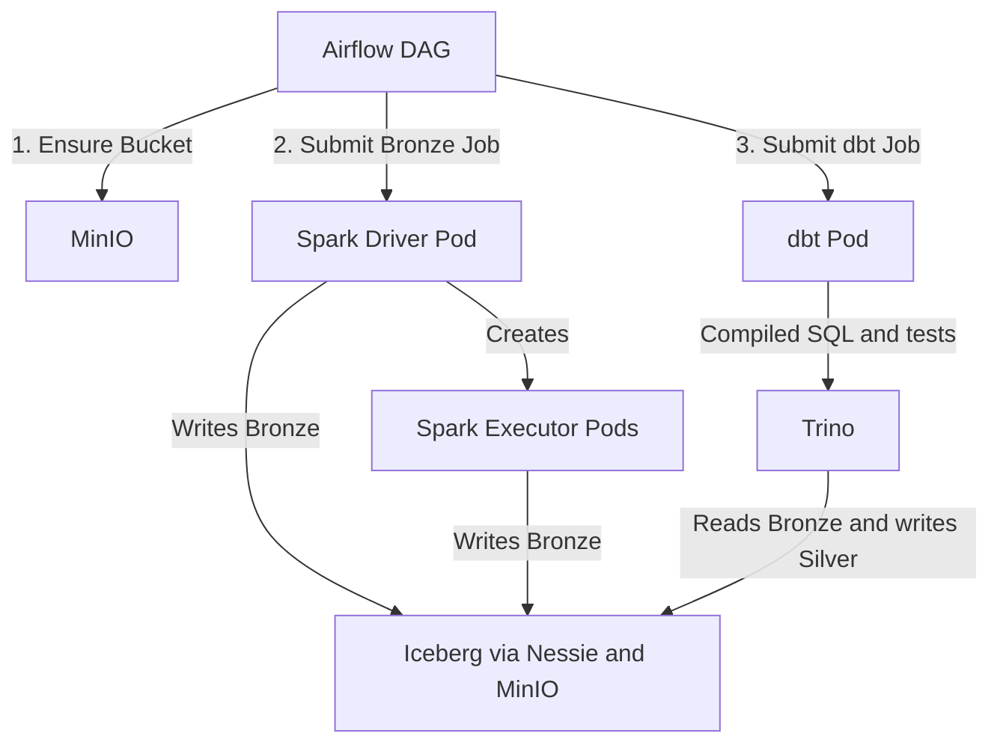

# FinLake — BFSI Data Platform

FinLake is a financial lakehouse running on Kubernetes. Airflow orchestrates
Spark ingestion and dbt transformations; Trino executes dbt SQL against Apache
Iceberg tables cataloged by Project Nessie and stored in MinIO.

---

## Stock Pipeline Overview

The production learning path is the Airflow DAG
`finlake_bronze_stock_prices_daily`. A run performs these steps:

1. **Warehouse Initialization:** Spawns a Kubernetes pod to ensure the MinIO bucket `finlake-warehouse` exists.
2. **Bronze Ingestion:** Runs `bronze_stock_writer.py` as a Spark Kubernetes Job and idempotently merges daily OHLCV rows into `nessie.finlake_bronze.raw_stock_prices`.
3. **dbt Silver Build:** Starts a short-lived dbt Kubernetes Job after Bronze succeeds.
4. **Trino Transformation:** dbt sends SQL to Trino, which creates `iceberg.finlake_silver.clean_prices` using the Bronze Iceberg data.
5. **Quality Gates:** dbt runs source, uniqueness, required-field, and OHLCV validity tests. Any failure fails the Airflow task and DAG run.

### Data Platform Configurations

* **Iceberg Warehouse Path:** `s3://finlake-warehouse/warehouse`
* **Nessie Metadata Catalog:** Host URL `http://finlake-nessie:19120/api/v1` (tracks table history and version branches)
* **MinIO Object Storage:** API Endpoint `http://finlake-minio:9000` (stores the raw data files and metadata specifications)
* **Trino Catalog:** `iceberg` (reads and writes Iceberg through Nessie)

---

## Deployment & Cluster Operations

GitHub Actions builds and pushes immutable commit-SHA and `latest` tags for the
Spark, Airflow, and dbt images. Kubernetes deployments should use the SHA tag;
the Airflow DAG derives the matching dbt SHA from `FINLAKE_SPARK_IMAGE`.

### 1. Apply Manifests & Restart Services

Apply the Spark RBAC permissions, refresh the Airflow deployments, and restart Airflow to pull the latest baked-in DAG image:

```powershell
# Apply Kubernetes manifests
kubectl apply -f k8s/minikube/spark-rbac.yaml
kubectl apply -f k8s/minikube/airflow.yaml

# Restart Airflow to pull the latest image version from the registry
kubectl rollout restart deploy/finlake-airflow -n finlake
```

### 2. Monitor Pipeline Jobs

After triggering `finlake_bronze_stock_prices_daily`, inspect both stages:

```powershell
# Track active Spark job execution and driver pod state
kubectl get jobs,pods -n finlake -l spark-pipeline=bronze-stock-prices

# View logs for the Spark driver pod
kubectl logs -n finlake -l app=finlake-spark,spark-role=driver --tail=200

# Monitor dynamically scaled executor pods
kubectl get pods -n finlake -l spark-role=executor

# View the dbt build and test output
kubectl logs -n finlake -l app=finlake-dbt --tail=200
```

---

## Architectural Breakdown

The system is split into four decoupled components designed to scale independently:



### A. Orchestration (Airflow)
* The pipeline starts inside an Airflow environment running in **Standalone Mode** (Scheduler, Executor, and Webserver run in a single process inside a single pod for simplified resource footprint).
* The custom [Dockerfile](./airflow/Dockerfile) builds upon Airflow `2.9.3`, pre-installing the required dependencies.
* The [Airflow Deployment](./airflow/airflow-k8s.yaml) sets up the pod running `airflow standalone`.
* The [stock pipeline DAG](./airflow/dags/bronze_ingest_daily.py) coordinates three sequential tasks:
  1. **MinIO Bucket Creation (`mc`):** Executes a startup job using the MinIO client image to run the bucket check command:
     ```bash
     mc alias set finlake http://finlake-minio:9000 minioadmin minioadmin && \
     mc mb --ignore-existing finlake/finlake-warehouse && \
     mc ls finlake/finlake-warehouse
     ```
  2. **Bronze Job:** Submits the Spark stock ingestion and waits for its driver and executor work to succeed.
  3. **Silver Job:** Runs `dbt build --fail-fast` in a bounded, temporary pod and streams its model and test logs into Airflow.

### B. Distributed Processing (Spark)
* When the DAG triggers `spark-submit`, a Spark Driver pod starts up. The driver reads the custom [entrypoint.sh](./spark/entrypoint.sh) to handle the startup sequence.
* Spark automatically starts worker pods using the same image. Because of this, the entrypoint script performs an argument check:
  ```mermaid
  graph TD
      Entry["entrypoint.sh"] --> IsExecutor{Is $1 == 'executor'?}
      IsExecutor -->|Yes| Exec[Start CoarseGrainedExecutorBackend]
      IsExecutor -->|No| Driver[Build spark-submit Command & Run]
  ```
* **Executor Branch:** Starts the internal Java executor process (`CoarseGrainedExecutorBackend`) to start processing tasks.
* **Driver Branch:** Assembles the full command line arguments and runs `spark-submit` to start the [PySpark Script](./spark/jobs/iceberg_transactions_job.py). The driver coordinates partitions, assigns tasks to executors, and monitors progress.

### C. Data Ingestion & Storage Layout
* When writing data, Spark first ensures the namespace (`finlake_bronze`) exists, creates the table target, and writes the contents.
* **Physical Layer:** Spark partitions data by `processing_date` and uploads the columnar Parquet files directly to S3 storage at:
  `s3://finlake-warehouse/warehouse/finlake_bronze/transactions_test/data/`
* **Metadata Layer:** Alongside data, Spark writes Iceberg manifest and structural files detailing schemas and partition keys under:
  `s3://finlake-warehouse/warehouse/finlake_bronze/transactions_test/metadata/`
* **Catalog Registration:** Once the physical files are written, the Spark driver submits a transaction commit to **Nessie**, updating the metadata pointer.

```
       [ Nessie Catalog Server ]
             |          |
      Commit |          | Pointer
             v          v
   [ Metadata JSON ]  [ Metadata JSON ]
   (Snapshot 1)       (Snapshot 2)
```

---

### 3. Verification

For verification of the deployed architecture, you can use the following commands:

```bash
kubectl run finlake-verify-debug --image=ghcr.io/saivarshithh/finlake-spark:latest -n finlake --restart=Never --command -- sleep 3600
```

This will deploy a pod with the image `ghcr.io/saivarshithh/finlake-spark:latest` in the `finlake` namespace. Once the pod is running, we can copy the verification script inside the pod.

```bash
kubectl cp ./spark/jobs/verify_iceberg_job.py finlake-verify-debug:/tmp/verify_iceberg_job.py -n finlake
```
Then, we can execute the verification script inside the pod.

```bash
kubectl exec -it -n finlake finlake-verify-debug -- /bin/bash
spark-submit --master "local[*]" /tmp/verify_iceberg_job.py
```

## Architectural Rationale: Why Nessie & MinIO?

### 1. Why Project Nessie over Hive Metastore?
For traditional data lakes, **Hive Metastore (HMS)** has long been the default choice. However, modern transactional lakehouses have requirements that HMS was never designed to solve. We selected Nessie for three key advantages:
* **Git-like Version Control for Data:** Nessie introduces branches (`main`, `dev`), tags, and merges to your tables. You can run ETL changes on a separate branch, test them, and merge them into production instantly and atomically—without copying or moving any physical data files.
* **Lightweight and Database-Free:** Hive Metastore requires running a heavy relational database (like PostgreSQL or MySQL) to maintain schemas and partitions. Nessie runs as a lightweight, API-first service with transactional log storage.
* **Atomic Multi-Table Transactions:** Nessie can commit changes across multiple tables simultaneously. If you write data to both a facts and dimensions table, Nessie guarantees downstream users will see either both updates or neither, preventing inconsistent partial reads.

### 2. Why MinIO?
* **Local S3 Compatibility:** MinIO runs as a lightweight service in our local Kubernetes cluster while exposing the exact same S3 API endpoints as AWS.
* **Seamless Cloud Portability:** Because Spark and Iceberg talk to MinIO using standard AWS SDK parameters, you can move this entire pipeline to a production cloud environment (AWS S3) without changing a single line of PySpark code.
